# Chat

> Created: 2021년 2월 4일 → 2021년 2월 14일  
> Git: https://github.com/minjeong13/Chat.git  
> Type: Firebase, React, Redux, Router, VSCode  

## Read me ──

파이널 프로젝트 주제로 인스타그램 클론코딩 비슷하게 프로젝트를 진행하였는데, 저는 따로 빠져서 채팅을 구현하게 되었습니다. 파이어베이스에 회원가입 정보, 채팅방, 채팅 내용을 저장하였고, 로그인 시 Redux에 로그인 한 유저의 아이디를 저장하여 닉네임을 불러와서 채팅방에 입장하도록 구현하였습니다.

이 프로젝트는 전부 리액트만으로 개발하였고, 파이어베이스를 사용하였습니다.

### Git File >

Chat > react-chat-app > src > components >

- RegisterPage : 회원가입 페이지를 구현. 회원가입시 입력한 정보는 파이어베이스에 저장됩니다.
- LoginPage : 회원가입 후 로그인이 가능한 페이지를 구현
- Chatpage : 로그인 후 바로 입장 가능한 채팅 화면 페이지를 구현

## Firebase ──

## Outputs ──

### Login

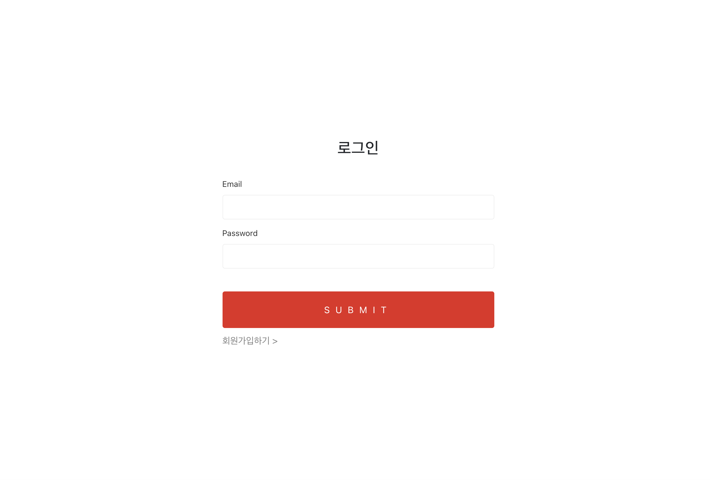

### Register

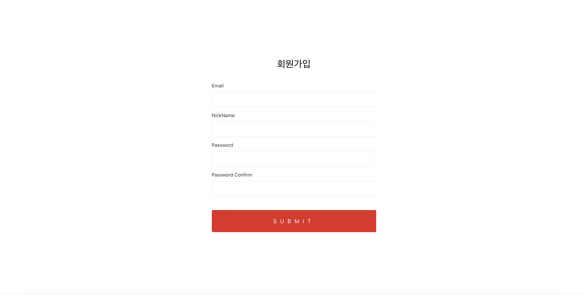

### Main Chat Page

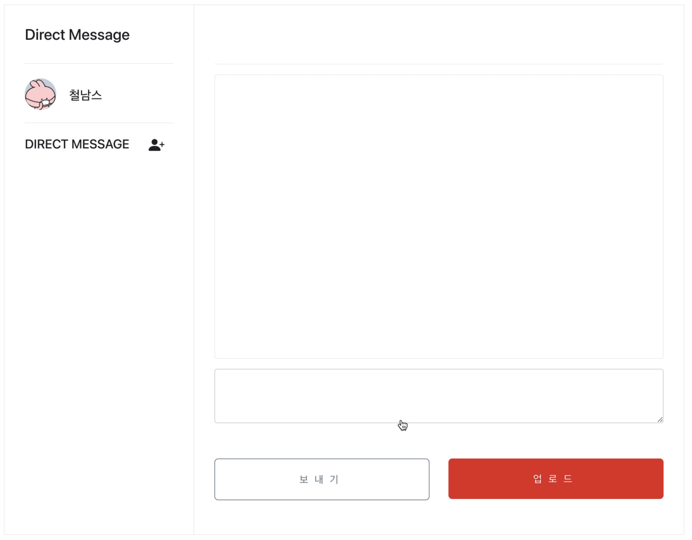

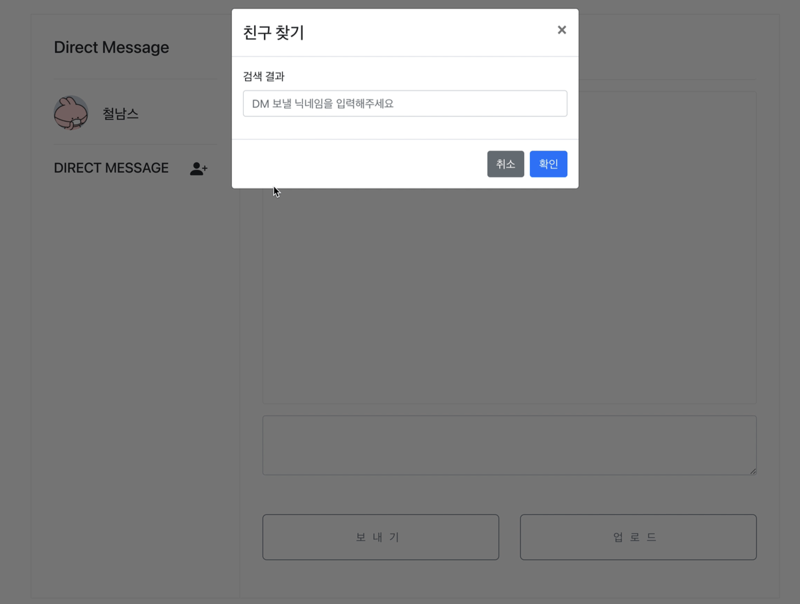

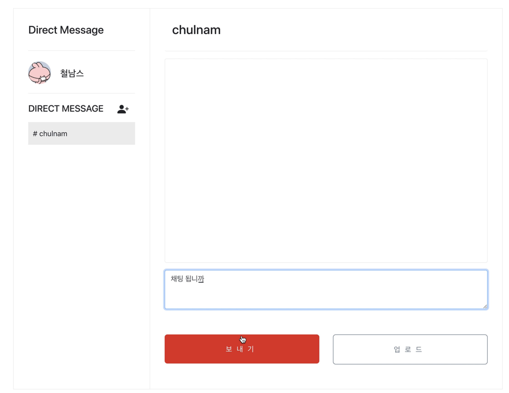

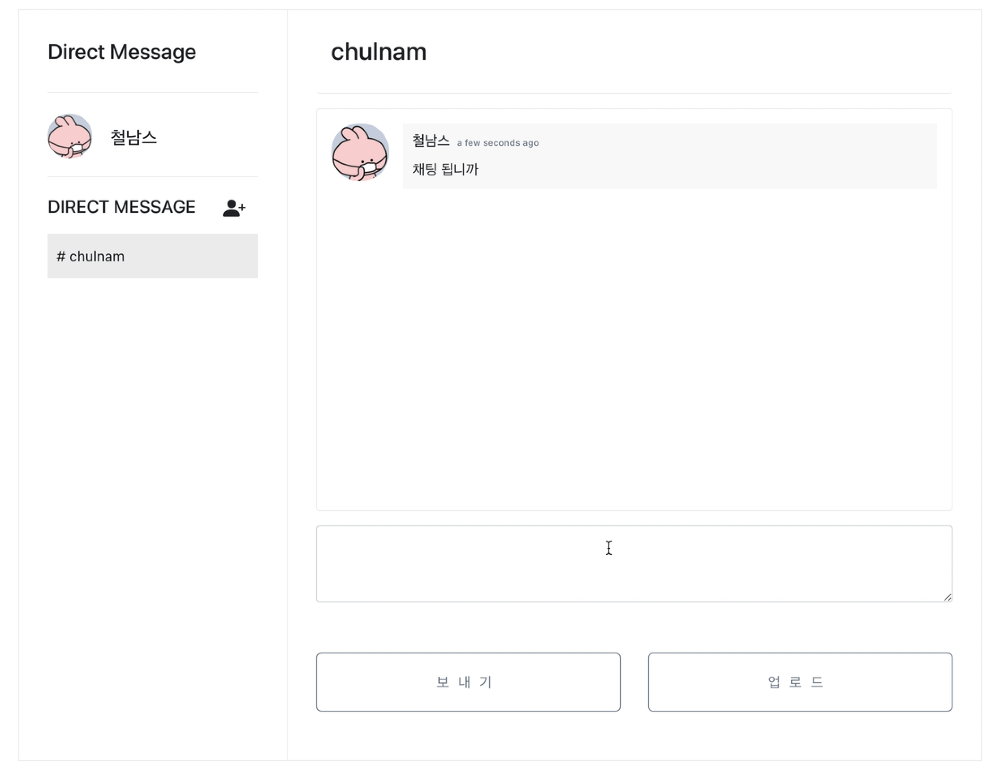

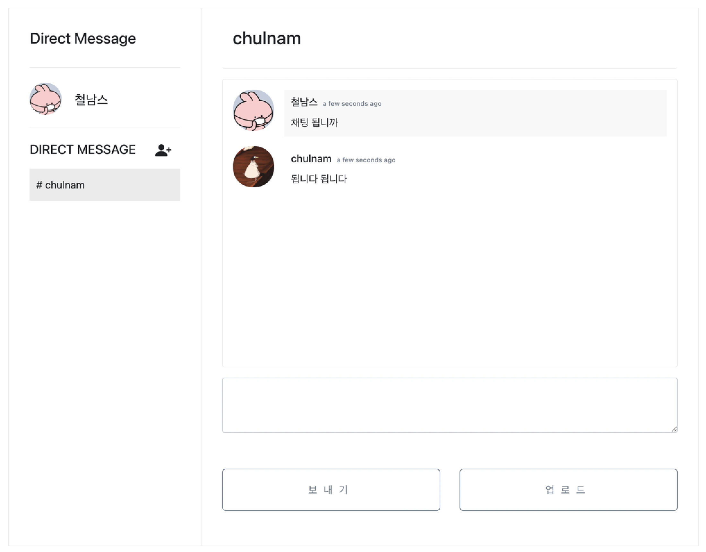

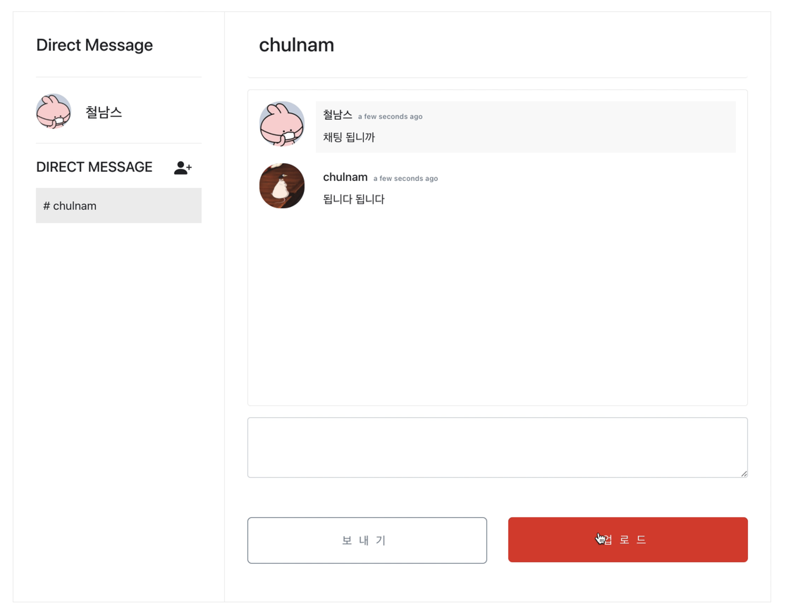

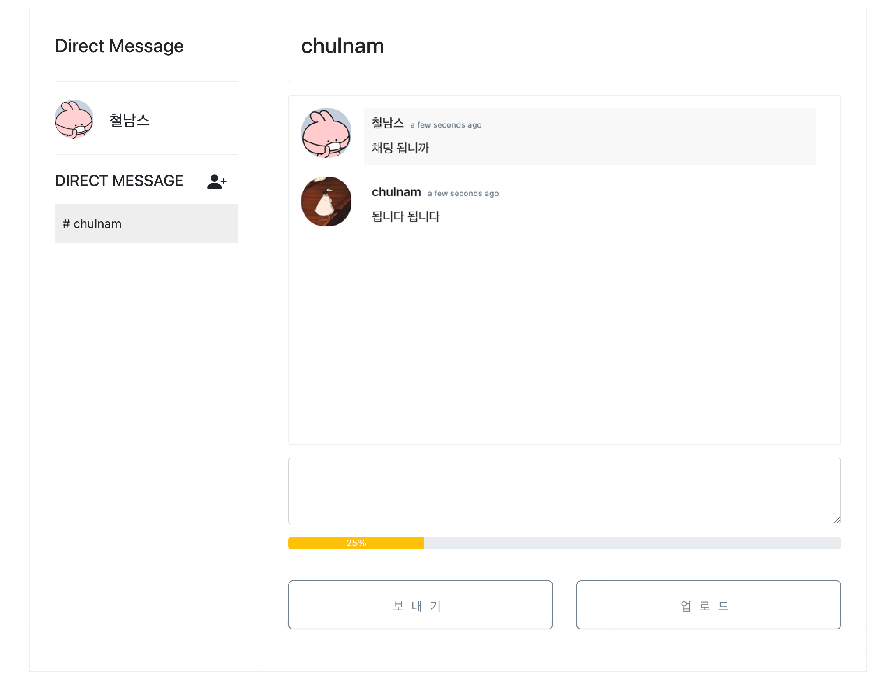

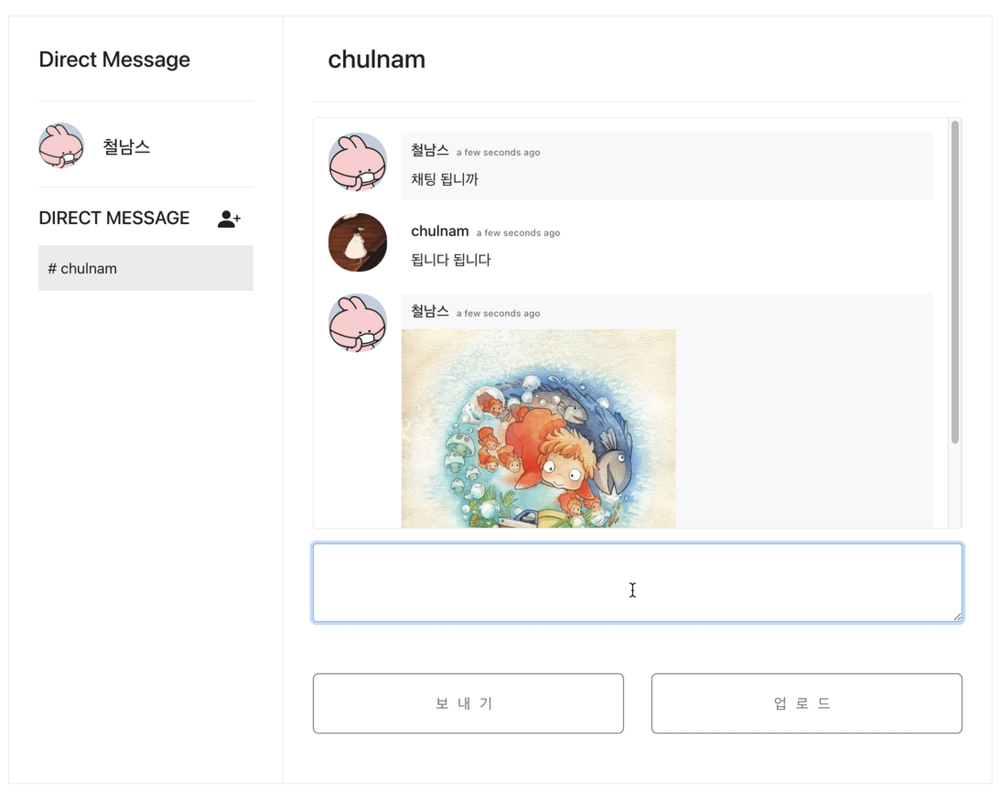

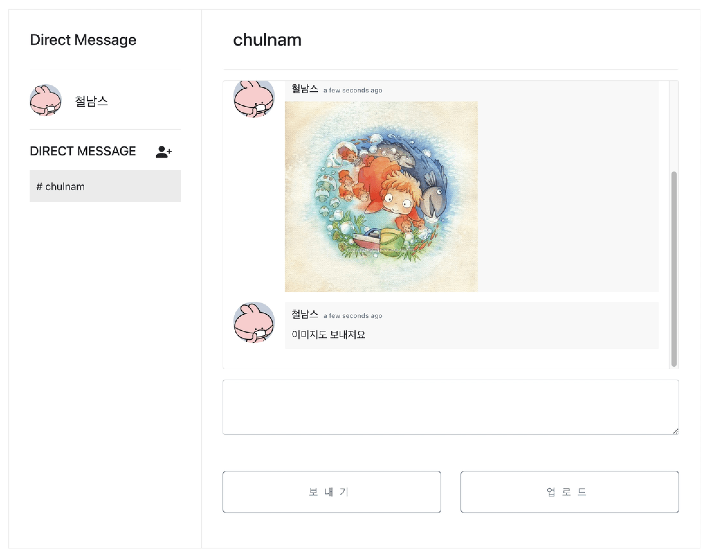